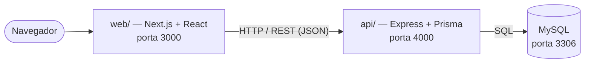

# ✈️ Aerocode

**Sistema web para gestão da produção de aeronaves.** Cadastro de aeronaves, peças, etapas de
montagem, testes e equipe — com login, controle de acesso por cargo e dados persistidos em banco.


> Projeto da disciplina, em três etapas: **AV1** definiu o domínio e as regras numa aplicação de
> linha de comando, a **AV2** desenhou a interface, e esta **AV3** une as duas numa aplicação web
> completa — front-end React conversando com uma API REST em Node.js e banco MySQL.

---

## 🚀 Como rodar

São três coisas para subir: o **banco**, a **API** e o **front-end**. Leva uns 5 minutos.

### Pré-requisitos

- [Node.js 18+](https://nodejs.org) (testado no Node 24)
- [MySQL 8](https://dev.mysql.com/downloads/) instalado e em execução

> Funciona em Windows e Linux — os comandos `npm` são os mesmos nos dois.

### 1. Banco de dados

Conecte no MySQL como `root` e rode o script abaixo. Ele cria o banco e o usuário que a aplicação usa:

```sql
CREATE DATABASE IF NOT EXISTS aerocode CHARACTER SET utf8mb4 COLLATE utf8mb4_unicode_ci;
CREATE DATABASE IF NOT EXISTS aerocode_shadow CHARACTER SET utf8mb4 COLLATE utf8mb4_unicode_ci;
CREATE USER IF NOT EXISTS 'aerocode'@'localhost' IDENTIFIED BY 'aerocode';
GRANT ALL PRIVILEGES ON aerocode.* TO 'aerocode'@'localhost';
GRANT ALL PRIVILEGES ON aerocode_shadow.* TO 'aerocode'@'localhost';
FLUSH PRIVILEGES;
```

> 💡 No Windows, o cliente do MySQL costuma ficar em
> `C:\Program Files\MySQL\MySQL Server 8.0\bin\mysql.exe`. No Linux, use `sudo mysql`.
> O banco `aerocode_shadow` é exigido pelo Prisma e não armazena nada — pode ignorá-lo.

### 2. API (`api/`)

```bash
cd api
cp .env.example .env       # Windows (PowerShell): Copy-Item .env.example .env
npm install
npm run migrate            # cria as tabelas
npm run seed               # popula com dados de exemplo
npm run dev                # sobe a API em http://localhost:4000
```

O `.env.example` já vem com as credenciais do passo 1 — se você não mudou nada no script, funciona direto.

### 3. Front-end (`web/`)

Em **outro terminal**:

```bash
cd web
npm install
npm run dev                # abre em http://localhost:3000
```

**Pronto.** Acesse **http://localhost:3000** e entre com um dos usuários abaixo. 🎉

---

## 🔑 Acessos de teste

A senha de todos é **`123456`**.

| Usuário      | Cargo           | O que pode fazer                                          |
| ------------ | --------------- | -------------------------------------------------------- |
| `gerson`     | Administrador   | Tudo, incluindo cadastrar funcionários                   |
| `rlima`      | Engenheiro      | Aeronaves, peças, etapas, testes e relatórios            |
| `cferreira`  | Operador        | Atualizar status de peças/etapas e consultar dados       |

> Há outros usuários no seed (`bnogueira` – engenheiro, `jalmeida` – operador), todos com a mesma senha.

---

## 🧱 Arquitetura



- **`web/`** — interface em Next.js / React. Telas de login, aeronaves, peças e funcionários.
- **`api/`** — API REST em Express + TypeScript. Autenticação por **JWT**, autorização por cargo,
  regras de negócio nos *services* e acesso ao banco via **Prisma ORM**.

```
AV3/
├── api/                 # Back-end (Express + Prisma + MySQL)
│   ├── prisma/          #   schema do banco e seed
│   └── src/             #   rotas, services e middlewares
├── web/                 # Front-end (Next.js / React)
└── docs/                # Enunciados (AV1–AV3) e relatório do projeto
```

---

## 📋 Regras de negócio

As mesmas regras definidas na AV1, agora validadas no servidor:

- **Código de aeronave único** — cadastro duplicado é recusado.
- **Etapas em sequência** — só uma etapa fica *em andamento* por vez, e uma etapa só é concluída
  depois que todas as anteriores terminaram.
- **Responsáveis sem repetição** — o mesmo funcionário não entra duas vezes na mesma etapa.
- **Acesso por cargo** — Administrador, Engenheiro e Operador enxergam ações diferentes.
- **Testes** dos tipos elétrico, hidráulico e aerodinâmico, com resultado aprovado/reprovado.
- **Relatório de entrega** gerado por aeronave e salvo em `api/relatorios/`.

---

## 🔌 API

A API roda em `http://localhost:4000`. Para conferir se está no ar: `GET /api/health`.
Toda rota (exceto o login) espera o header `Authorization: Bearer <token>`.

<details>
<summary><strong>Ver principais endpoints</strong></summary>

| Método  | Rota                               | Descrição                          |
| ------- | ---------------------------------- | ---------------------------------- |
| `POST`  | `/api/auth/login`                  | Autentica e retorna o token JWT    |
| `GET`   | `/api/aeronaves`                   | Lista as aeronaves                 |
| `POST`  | `/api/aeronaves`                   | Cadastra uma aeronave              |
| `POST`  | `/api/aeronaves/:codigo/pecas`     | Vincula uma peça à aeronave        |
| `POST`  | `/api/aeronaves/:codigo/etapas`    | Cria uma etapa de montagem         |
| `POST`  | `/api/aeronaves/:codigo/testes`    | Registra um teste                  |
| `POST`  | `/api/aeronaves/:codigo/relatorio` | Gera o relatório de entrega        |
| `PATCH` | `/api/etapas/:id/status`           | Inicia, finaliza ou reabre a etapa |
| `POST`  | `/api/etapas/:id/responsaveis`     | Associa um responsável à etapa     |
| `GET`   | `/api/pecas` · `/api/funcionarios` | Catálogo de peças e equipe         |

</details>

> Cada resposta inclui o header `Server-Timing` com o tempo de processamento, usado na análise
> de desempenho do projeto.

---

## 📄 Documentação

Os enunciados de cada etapa e o relatório do projeto estão em [`docs/`](docs/).
