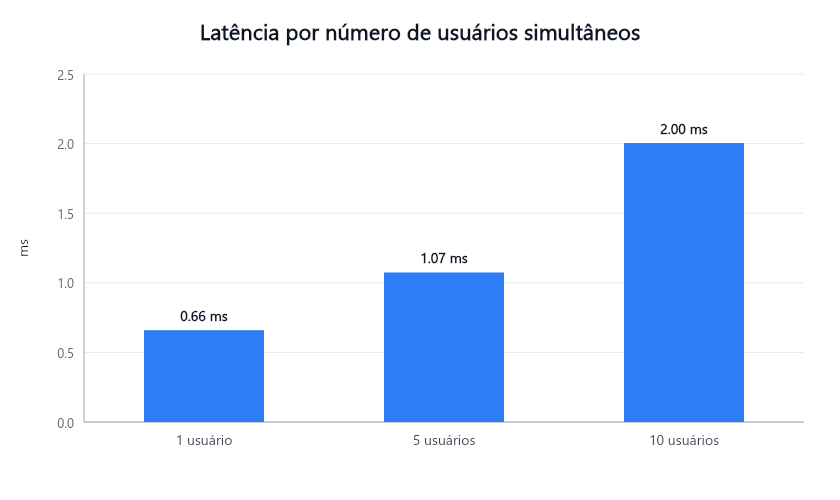
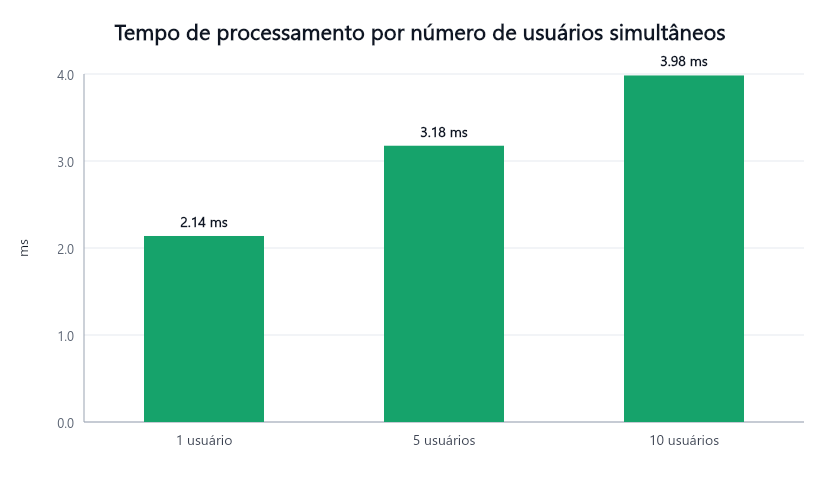
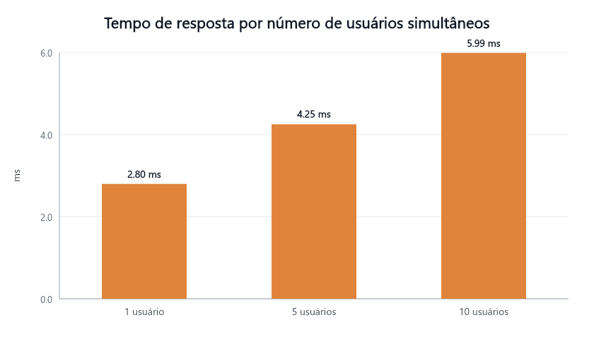

# Relatório de Qualidade — Aerocode

> Gerado automaticamente por `npm run bench` em 05/06/2026, 19:12:19.

Este relatório apresenta a análise de desempenho da aplicação web Aerocode, conforme
exigido na AV3. São medidas três métricas — **latência**, **tempo de processamento** e
**tempo de resposta** — sob carga escalada de **1, 5 e 10 usuários simultâneos**. A
unidade de todas as medições é o **milissegundo (ms)**.

## Como as métricas foram obtidas

O benchmark (`api/bench/run.ts`) atua como cliente HTTP e dispara requisições reais
contra a API (`/api/aeronaves`), autenticado via JWT. Para cada requisição:

- **Tempo de resposta** — medido no cliente com `performance.now()` imediatamente antes
  do `fetch` e logo após o corpo da resposta ser totalmente recebido. É o tempo total
  percebido pelo usuário.
- **Tempo de processamento** — medido no servidor pelo middleware `metrics`
  (`api/src/middleware/metrics.ts`), que cronometra o handler com
  `process.hrtime.bigint()` e expõe o valor nos headers `X-Processing-Time-Ms` e
  `Server-Timing`. O cliente apenas lê esse header.
- **Latência** — calculada como `tempo de resposta − tempo de processamento`,
  representando o tempo gasto no trajeto de rede (ida e volta), conforme a Figura 1 do
  enunciado.

A carga de N usuários é simulada com **N trabalhadores concorrentes** (`Promise.all`),
cada um executando 30 requisições em sequência, após uma fase de
aquecimento de 5 requisições por usuário (descartada). Os gráficos usam a
**média** de cada métrica; a tabela traz também o percentil 95 (p95).

## Resultados

| Usuários | Amostras | Latência (média / p95) | Processamento (média / p95) | Resposta (média / p95) |
| --- | --- | --- | --- | --- |
| 1 | 30 | 0.66 / 0.95 ms | 2.14 / 2.52 ms | 2.80 / 3.36 ms |
| 5 | 150 | 1.07 / 2.51 ms | 3.18 / 4.74 ms | 4.25 / 6.97 ms |
| 10 | 300 | 2.00 / 3.43 ms | 3.98 / 5.48 ms | 5.99 / 8.61 ms |

### Latência

### Tempo de processamento

### Tempo de resposta

## Observações

- Cliente e servidor executados na mesma máquina tendem a apresentar **latência de rede
  muito baixa**, já que não há trânsito por roteadores externos; o tempo de resposta é
  dominado pelo processamento. Para observar latências maiores, execute o benchmark com
  `BENCH_BASE_URL` apontando para a API hospedada em outra máquina/rede.
- Parâmetros configuráveis por variáveis de ambiente: `BENCH_BASE_URL`, `BENCH_USER`,
  `BENCH_PASS`, `BENCH_ENDPOINT`, `BENCH_LEVELS`, `BENCH_REQUESTS`, `BENCH_WARMUP`.
